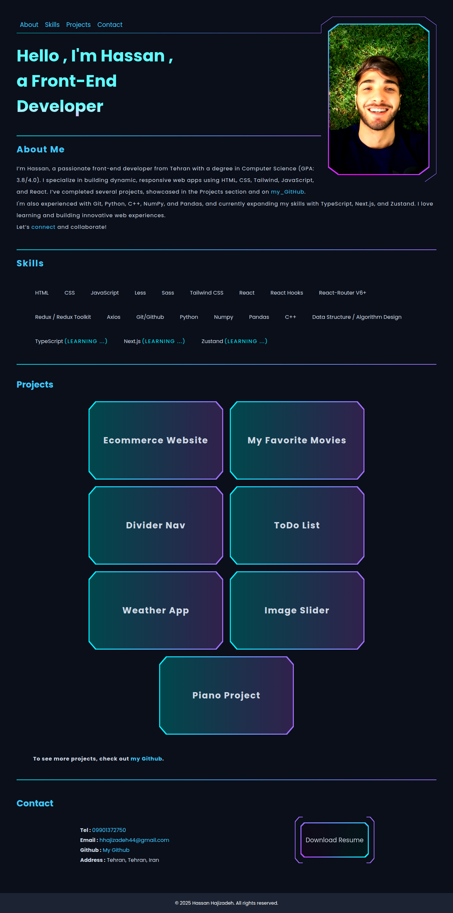

# React Portfolio

A modern, responsive front-end portfolio built with React.js and Vite.
---
# [DEMO](https://hassanhajizadeh.netlify.app)

## scrrenshot

## Features

- ⚡ Built with React 19 for fast, interactive UIs
- ⚙️ Vite for instant dev server & optimized builds
- 🎨 Uses FontAwesome for rich iconography
- 📱 Fully responsive design for all devices
- 🧩 Component-based architecture for maintainability
- 🧹 Linting with ESLint and React Hooks best practices

## Getting Started

### Prerequisites

- Node.js (v18 or higher recommended)
- npm

### Installation

```bash
git clone https://github.com/hassanhajizadeh/react-portfolio.git
cd react-portfolio
npm install
```

### Development

To start the development server:

```bash
npm run dev
```

Open your browser at the local address shown in the terminal.

### Building for Production

```bash
npm run build
```

### Preview Production Build

```bash
npm run preview
```

### Lint the Code

```bash
npm run lint
```

## Tech Stack

- [React](https://react.dev/)
- [Vite](https://vitejs.dev/)
- [FontAwesome](https://fontawesome.com/)
- [ESLint](https://eslint.org/)

## Project Structure

- `/src` — Main source code (components, views, styles, etc.)
- `/public` — Static assets and the main HTML template
- `vite.config.js` — Vite configuration
- `eslint.config.js` — ESLint configuration

## Customization

Update the content in `/src` to personalize your portfolio, add your projects, skills, and contact information!

---

> Inspired by modern web standards and optimized for performance & maintainability.
